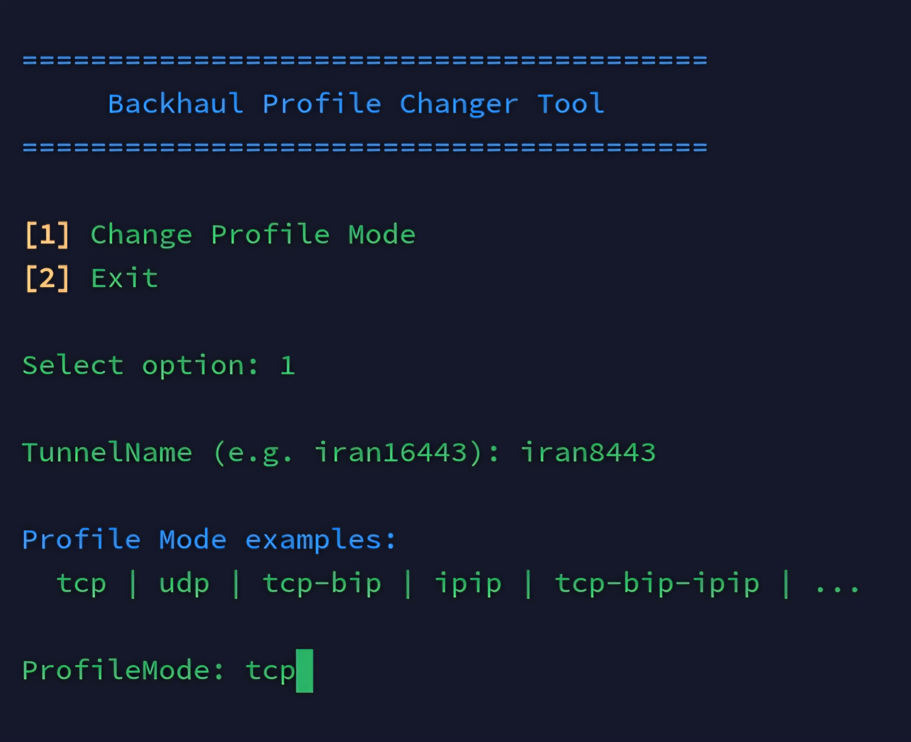

<div dir="rtl">

# 🔄 Backhaul Profile Changer

<p align="center">
  
</p>

<p align="center">
  
  
  
</p>

---

## 📌 معرفی

ابزاری ساده و سریع برای **تغییر پروفایل Backhaul** بدون نیاز به نصب.  
با یک دستور اجرا کنید و پروفایل تانل خود را مدیریت کنید.

---

## ⚡ اجرای سریع (بدون نصب)

```bash
bash <(curl -fsSL https://raw.githubusercontent.com/Sajjad-Alimadadi/backhaul-profile-change/main/backhaul-profile-change.sh)
